# OOP
string.append()
string.pop()
string.remove()
string.extend()
def:
    """
    >>>
    >>>
       
    """
unicodedata

tuple 1,2,3,4
=(1,2,3,4)

at least one thing they can agree on : the other is False
if tuple contains a list it can still change
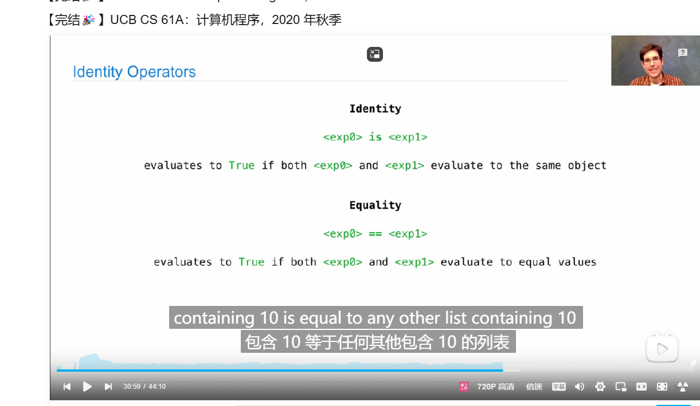


notice return

notice is_

be brave to use len(list) not shamed


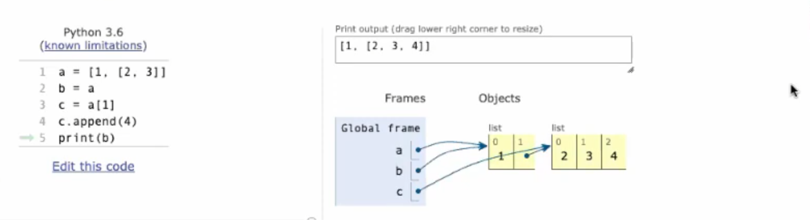

interesting only one copy of data


self-reference list  store differs from print


selector and constructor equals bulit-in-python function
distinguish betweeen list assignment and slicing assignment
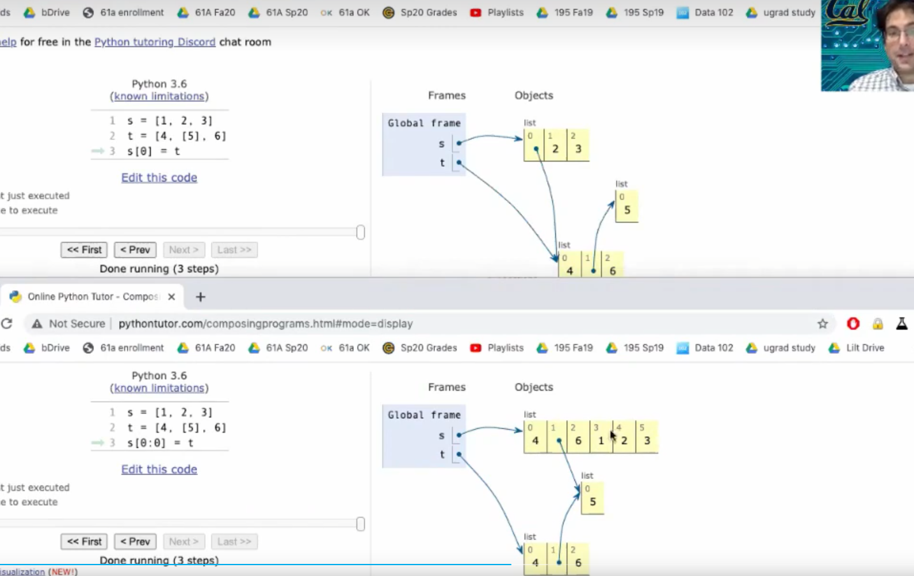

class like a blueprint
objects like houses

non-local statement     can re-blind the local var to the parent frame
切记 不是没有定义该statement 只是指向两个frame 冲突
list is mutable in python  can be an another way to express mutable function

distinguish between function type  and  is


(iter) gives a position create a iterator
(next) gives a value and change position

list shows what we have used up

dictionary.keys()
dictionary.values()
dictionary.items()

明天上完早八
静下心来
好好想代码
不再观看答案与gpt除非实在搞得太久

today's conclusion 2024/9/9

min and max
data abstraction
multiple judgement
assert statement

textbook is waiting for me to read


lazy iterartor: really funny
map
filter
zip
reversed

generator is a special kind of iterator
it's yield can stop but remember and excute many times

generator can yield from iterator

getattr and dot expression look up a name in the same way

pop(i): Remove and return the element at index i.


    if not s:
        return []
    elif s[0] == before:
        return [s[0]] + [after] + insert_items(s[1:], before, after)
    else:
        return [s[0]] + insert_items(s[1:], before, after)
  
  因生成新列表而失败
  lose

  反思 while 用少了 生疏了 自己也没想到 while 其实与recursive更类似，不需要for的计数存储

  多看英文

  while True
  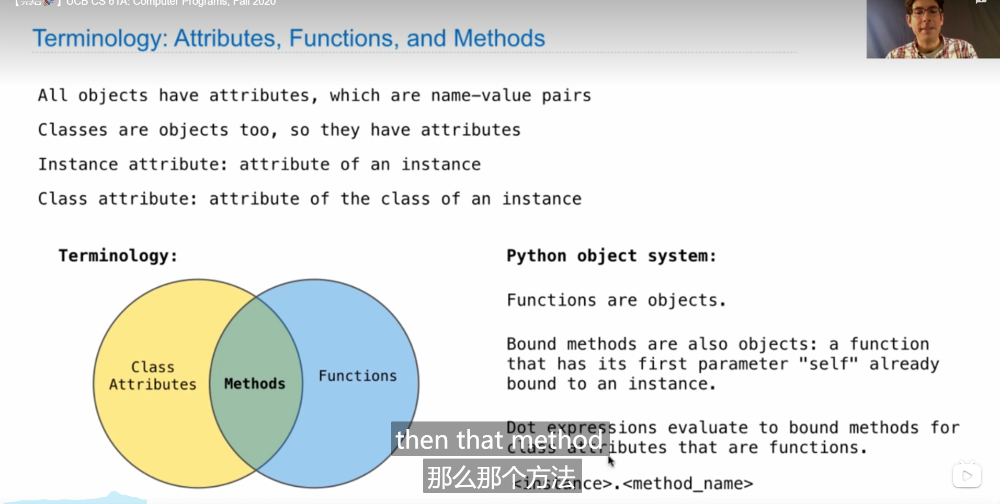
  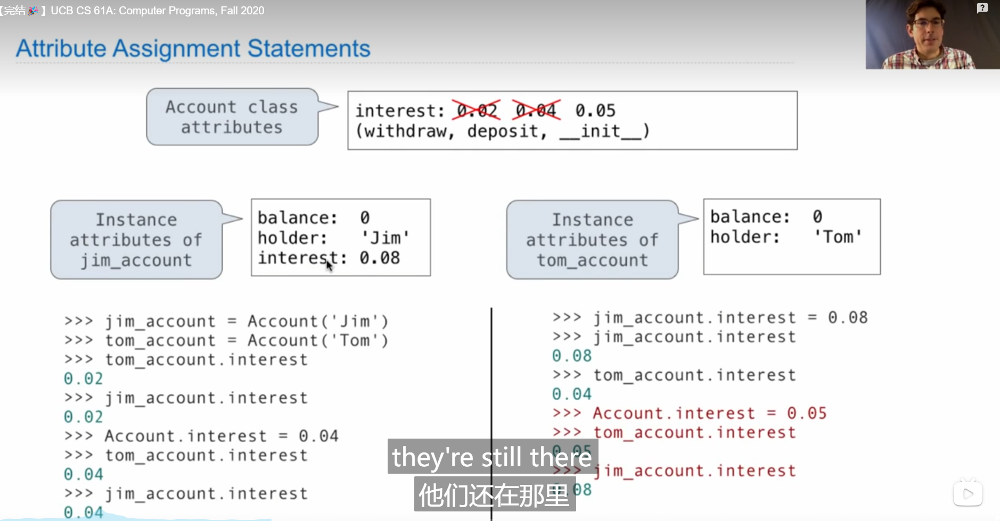
  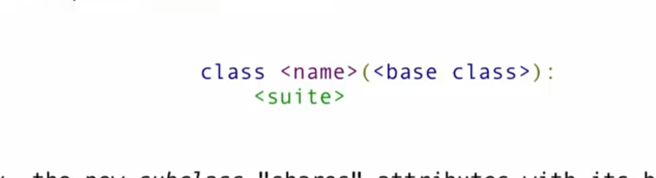
  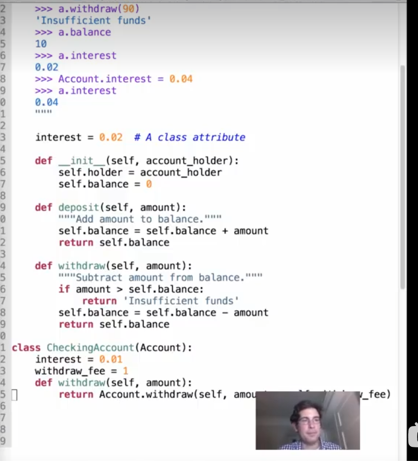
  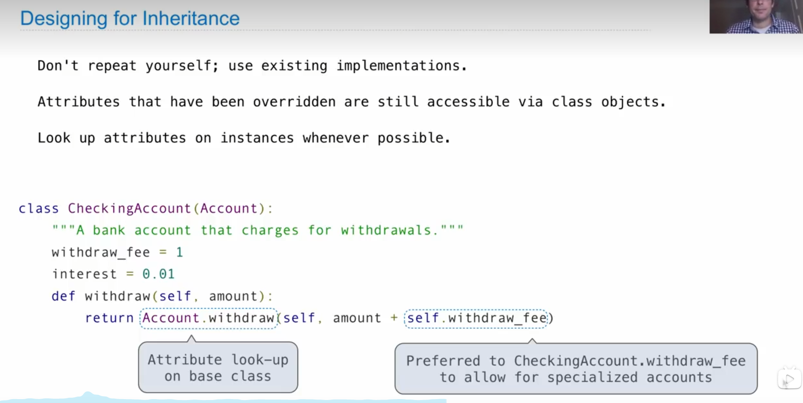
  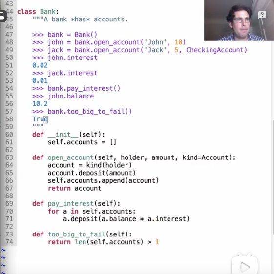
  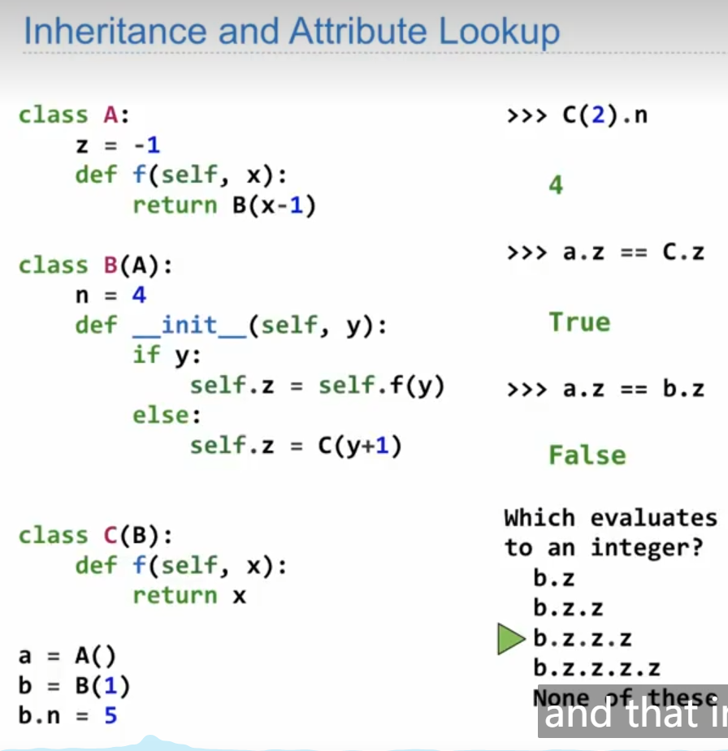


iterator part:
reflection on merge:
1. next 的存储
2. 抛弃for 与 yield from 改用next
3. 条件控制 在yield的选择上的应用
4. 利用循环构建generator
5. tree abstraction  若要返回tree 往往采用tree recursive 即tree(label, f(i) for i in branches)
6. 函数加在 branches
7. 叶子往往为基本情况 
8. 对于branches有的时候为遍历， 有时需要对树枝再用for, 有的时候为min max
9. 经典的构造就是if elif else  用generator递归或者用函数递归


OOP的一些重要概念：
class attribute including method == functions
look for instance attribute at first and then class attribute

argument is in __init__ def  make an instance  it is a constructor

真他妈难

Account.deposit(a, 100)
f super without self  super().withdraw(...)


tracing tree recursion is really hard but you can make it a abstraction
or use few examples
two keys:
1. don't try to trace the last call
2. think about simple samples

object and class
attribute and method

class Account:
    self.interset = 0.02
    def __init__(self, holder):
        self.holder = holder
        self.balance = 0
    def deposit(self, amount):
        self.balance = self.balance + amount
        return self.balance
    def withdraw(self, amount):
        if self.balance < amount:
            return 'no sufficent fund'
        else:
            self.balance = self.balance - amount
            return self.balance

is or is not can compare independence

get attr 作为. 表达式的替代物

function 作为class attribute;
method 作为instance attribute

Account.deposite(ge_shuai, 10000000000)   2 argument
==
ge_shuai.deposit(10000000000000000) 1 argument


类名 capwords so account should be substitute for Account
方法名 小写

class attribute for public
class Account:
    interest = 0.05

attribute
outside Account.interset = 0.07


special function
str() 供人类可读
repr() 供python解释
tue.__str__() 打印时自动调用
tue.__repr__() 交互时自动调用
repr(object) = string
eval(repr(object)) == object

eval 's argument must be string or code

repr(min) maybe different  cannot generate a python expression but gives a <>

>>> repr(half)
>>> 'Fraction(1,2)'
>>> str(half)
>>>'1/2'

repr(s) give a string
and eval(repr(s)) gives the original string
__str__ and __repr__ are method 
and they are polymorphic functions

str is class not a function
call str == call constructor

repr() differs from self.__repr__
repr is what we implemented

object pass message by look up attribute

an interface is a set of shared message

str() is much more complicated

format string
({0},{1}).format(x1,x2)


speial method name
__bool__
__init__
__repr__
__str__
__add__
__float__

Ratio(1,3) + Ratio(1,6)
=
Ratio(1,3).__add__(Ratio(1,6))

# greatest common devisor
def gcd(n,m)
    while n != m:
        n, m = min(n,m), abs(n-m)
    return n\

isinstance(instance, standard)
two important concept: type dispatching and type 强制转换


__init__后面要加引号 一直忘记

class Kangaroo:
    def __init__(self):
        self.content = []
    def put_in_pouch(self, new):
        if new in self.content:
            print ("object already in pouch")
            return
        else:
            self.content.append(new)
    def __str__(self):
        if not self.content:
            print ("The kangraoo's pouch is empty")
        else:
            print("The kangrapp's pouch is" + str(self.content))

test code is very important for us to verify in the OOP courses

str is a class

isinstance 和 type 略有一些区别
repr can show anywhere as a bulit-in function
[1,2]
repr([1, 2])
[1,2].__repr__()

when we need to create a class, we need to def __repr__


beautiful recursive definition
def all_path(t):
    if is_leaf(t):
        yield [label(t)]
    for b in branches(t):
        for i in all_path(b):
            yield [label(t)] + i 

def print_all_path(t):
    for i in all_path(t):
        print(i)
two for loop

again repr first look at class the instance

no need for argument as str and try hard for generating just consider it  as a object

在email问题中 self作为参数非常关键 作为object 需要理解深刻 对driver理解深刻


sometimes recursive is dramatic even if you don't trust it it can succeed.

enjoy the magic of computer programming

ctrl + F 搜索代码

这就像重新学一门语言一样

avoid affect the original list
by using list() or s[:]
python super() 使用父类方法


overridern

也可以super().method()
super().__init__(health)\

明天再看一遍super()的意义
inheritance 的意义
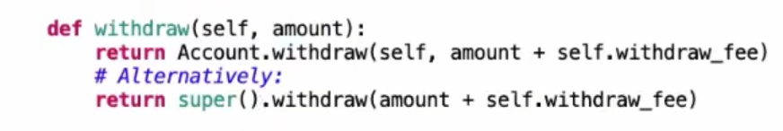

Linked list
can be considered as a pair: the first and the rest
the first is an attribute value
the rest is a link.empty or a linked list
link(3,link(4,link(5,link.empty)))

``` python
class Link:
    empty= ()
    def __init__(self, first, rest = empty)
        assert rest is link.empty or isinstance(rest, link)
        self.first = first
        self.rest = empty
```
suitable for mutable var


def range_link;map_link; filter_link from scratch
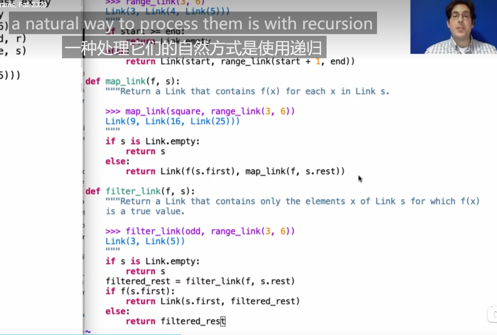

循环链表

recursive problem:
draw a diagram 
and think about several basic situation
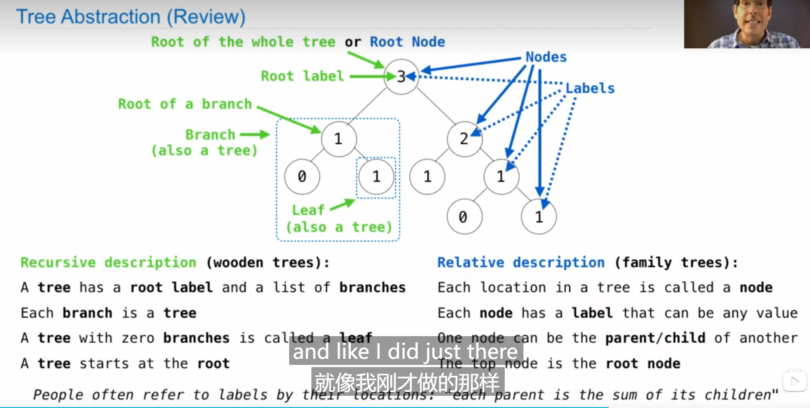

composition 这节课相当精彩 第一次接触linked list 

all_leaves.extend
list.extend 函数出现了！
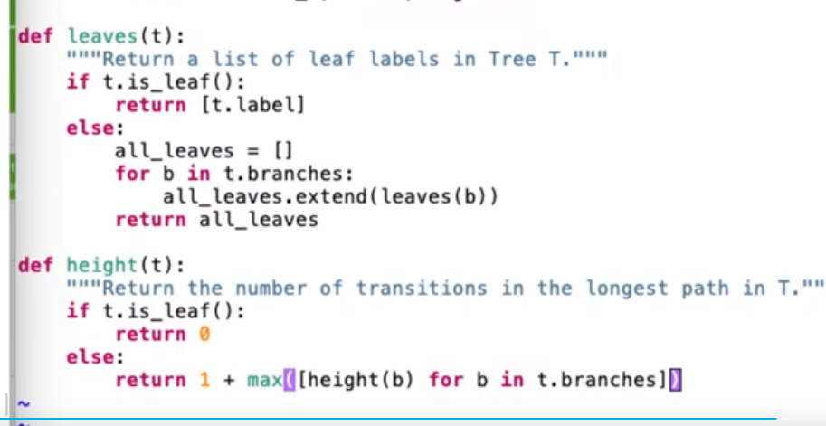

remove some subtree from a tree is called pruning
not use return for not compute a new value
python -m doctest ex.py

s.rest = s
assert 中的语句一旦为假 直接响起assert error

找了半天发现少一个参数

overriden  = def + return 原本

***copy太重要啦***！ list or s[:]

return
或者直接调用父函数的值
with great power comes great responsibility. 
but they say the best defense is a good offense
ThrowerAnt.action(self, gamestate)
Ant.double(ant)更有用是为啥

fireant 太经典了
珍惜好状态

>>> We've been developing this ant for a long time in secret. It's so dangerous  that we had to lock it in the super hidden CS61A underground vault, but we finally think it is ready to go out on the field 
hhhh
