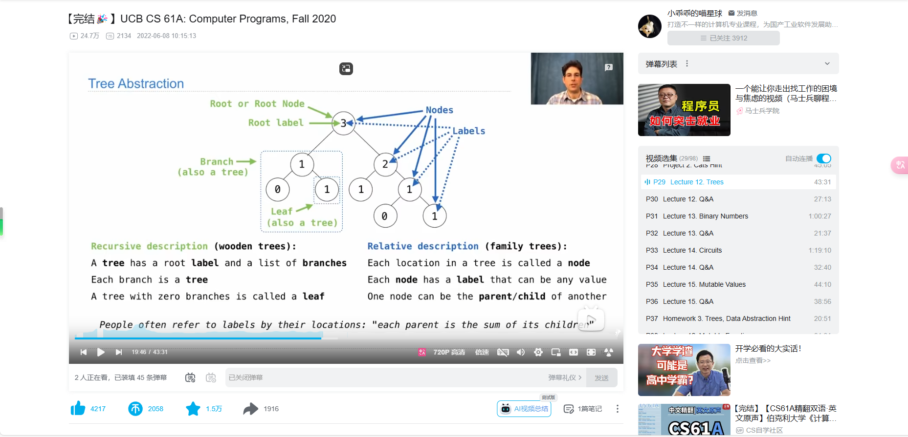

# data abstraction
In other words, we can make an abstraction that separates the way the function is used from the details of how the function is implemented. Analogously, data abstraction isolates how a compound data value is used from the details of how it is constructed.
constructor and selector
barriers built for large projects
objects-oriented programming
on fire code
assert leads to False
built in functions:
sum(start_value)[] or 0
max (key_functions) min
all-----bool    any----bool

assert is_tree(), 'xxx must be tree'\

min function and its key  it could do anything for you

spend more time debugging my codes before

if is_leaf(t):
        t[1:] = [tree(i) for i in leaves]
    elif is_tree(t):
        for i in branches(t):
            sprout_leaves(i, leaves)
    return t

above is violate data abstraction version

if is_leaf(t):
        return tree(label(t), [tree(i) for i in leaves])
    else:
        return tree(label(t), [sprout_leaves(i, leaves) for i in branches(t)] )

