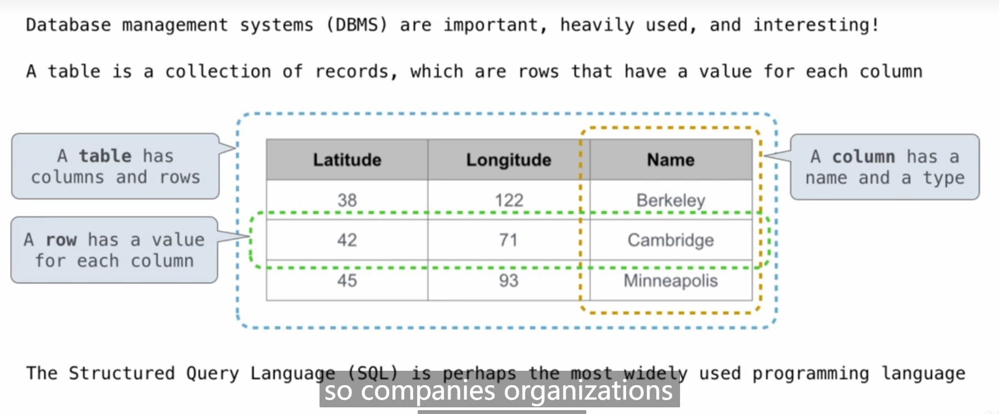
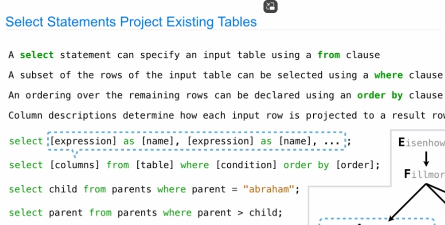
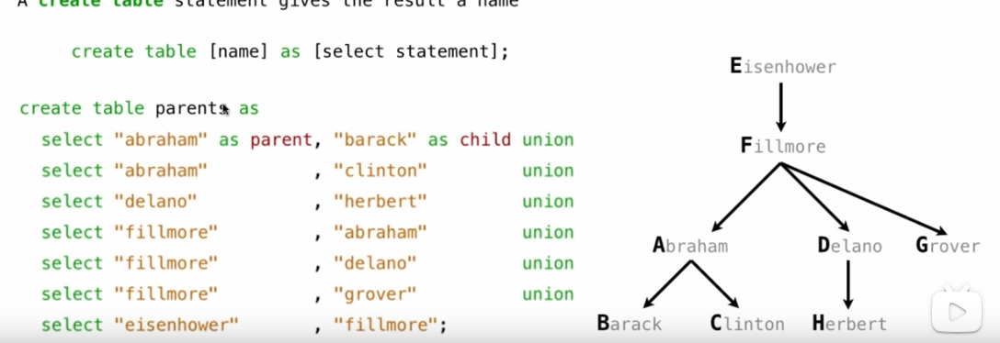

# declarative programming
just choose the most efficient procedures


``` sql
create table cities as
select 55 as latitude, 58 as longitude, "Berkeley" as name union
select 42,             71,              "Shanghai"         union
select 99,             99,              "Beijing";

select "westcoast" as Region, name from cities where longitude > 99 union
select ohter                  name from cities where longitude <= 99;


select statement won't be stored
```


code.cs61a.org


union means more rows to be added
select from<> where<> order by<>

### caole 总是多括号