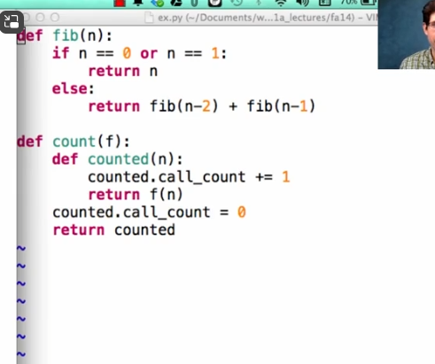

# efficiency

1. trace function : when called count+= 1
2. 
3. memorization
``` python
def memo(f):
    cache = {}
    def memorized(n):
        if n not in cache:
            cache[n] = f(n)
        return cache[n]
    return memorized
```
4. cache 缓存
5. function can have attribute
``` python
def count(f):
    def counted(n):
        counted.call_return +=1
        return f(n)
    counted.call_return = 0
    return counted
```
6. jupterbook for python output is chart
7. linear or logarithmic
8. 数据结构：字典的查阅速度留在cs61b
9. exponential quadratic linear logarithmic
10. big O 
11. big seta
12. counted.open_count 
13. counted.call_return
14. space and time
15. open_count and max open_count