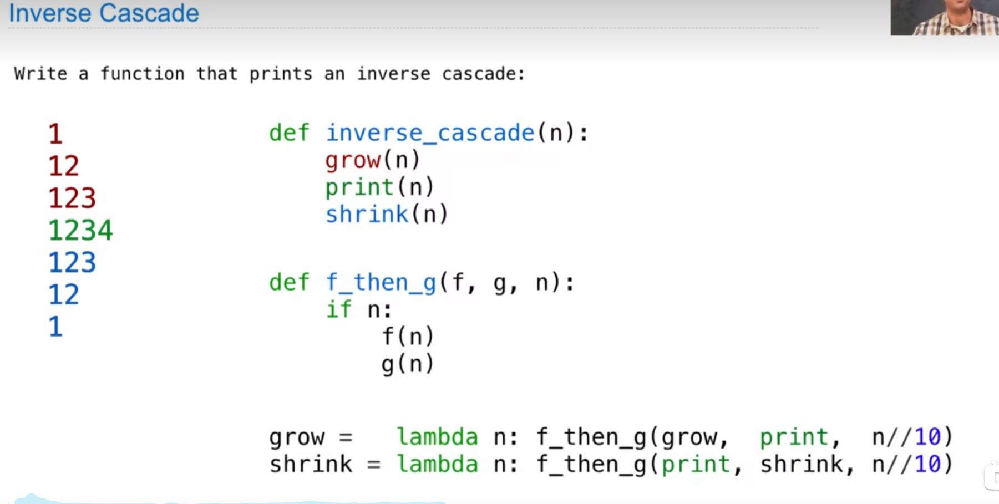

beautiful luhn algorithm

state is where and what's the computation

count partitions

note:
1. return or simple print
2. figure out the simplest condition at first
3. don't stuck in one 
4. def hailstone(n):
    """Q1: Yields the elements of the hailstone sequence starting at n.
       At the end of the sequence, yield 1 infinitely.

    >>> hail_gen = hailstone(10)
    >>> [next(hail_gen) for _ in range(10)]
    [10, 5, 16, 8, 4, 2, 1, 1, 1, 1]
    >>> next(hail_gen)
    1
    """
    "*** YOUR CODE HERE ***"
    yield n
    if n == 1:
        yield from hailstone(n)
    elif n % 2 == 0:
        yield from hailstone(n // 2)
    else:
        yield from hailstone(n * 3 + 1)