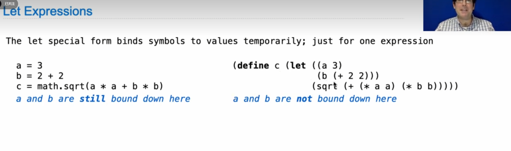

# A new language scheme

web scheme interpreter
a dialect of Lisp
combination(quotient 10 2) (not True)
procedure  == function
interpreter doesn't care about indention however easy to read

built-in function:
1. +
2. number?
3. 0?
4. integer

if expression:(if pred cons alter)
and or : (and x1 x2) (or x1 x2)
define: (define symbol expression)
define procedure:
define(symbol formal parameters(body))


define ((plus4) x (x+4))
=
define(plus4 (lambda(x) (+ x 4)))

scheme interpreter project 4

lambda(x y z) ( + xy (square z))

(+ 1 2 3)
(fd 100)
(rt 90)
(ft 50)
define(twice fn)(fn)(fn)


太震撼了 我也想学这个

``` scheme
(cond((> x 5) (print 'big ))
      (else(print 'small)))
```





symbolic programming  using '

a = list('quotient 10 2)
eval(a)

list( '+ 1 2)

crazy: write a programme that generates programmes


and 
or
cond
if

(define zrx jc)


scheme interpreter 核心在于 递归的调用参数

https://en.xiaoz.org/post/18207

is_available(): # be careful about the parentheses
      
try:
`````
except  as e:
`````
finally:

# e is an instance of exception and an instance of ZeroDivisionError

set! is a non-local statement


reduce a sequence to a value

list 和 cons的区别在于cons需要调用多次

review map(function, list)
give you a list


## calculator
1. scheme_read and read_tail
2. class pair repre
3. cal_eval:
   integer
   exp  (exp.second.map(eval))

4. cal_apply(first, arguments)
      add
      minus
      multiply
      quotient
5. user interpreter interact 
6. raise exception
   only keyboard interpretation will end the programme

> reading a book will only leave you with a fleeting knowledge, you just need to start coding

notice: (or cond cond cond)

列表的写法是 '(1 2 3)
instead of (1 2 3) which is a function call

conclusion:
1. use recursive
2. 感觉base case 都是(null? s) 
3. (cons (new)
   (other recursive))
4. 出错在少了cdr
5. use (map func list)

scm> (load 'tests)

scheme error is basic none

ctrl + z + enter to exit


为什么要转成python的list


千古谜题
为什么一直要validtate (1 2)
真相 嵌套列表
procedures are nested lists

神奇的是procedure的本质均是lambda 

''' scheme
(apply + '(1 2 3))
···

let's begin our high-order function


begin的意义：
顺序执行
前面体现副作用
最后一个为返回值