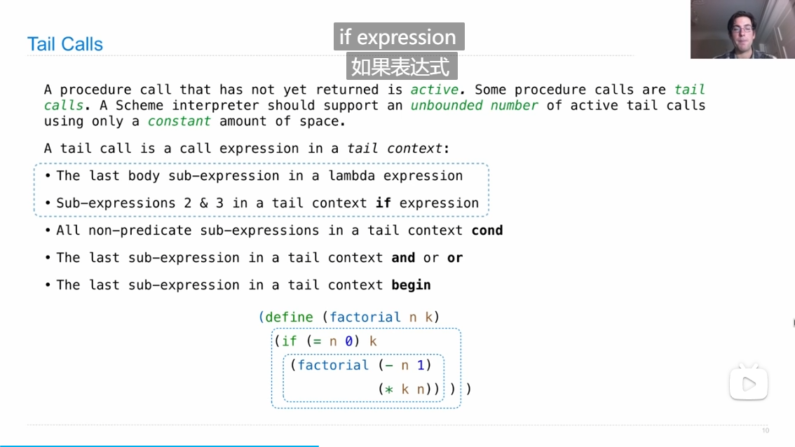
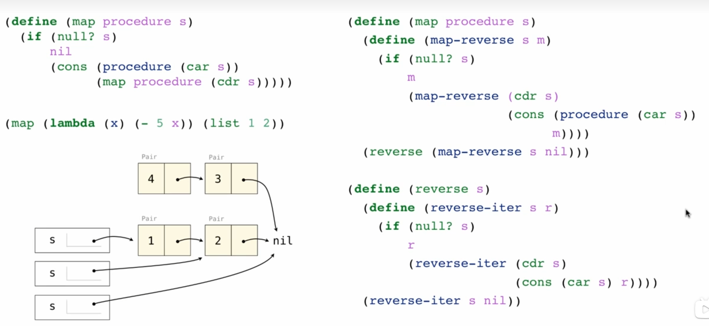

# tail recursion

reduce procedure use the arg pro to combine the ini to the element of the list which is different from the apply

tail context : two comprehensions:
1. just the last step to return a result
2. some judgment rules

tail recursion 本质上是循环