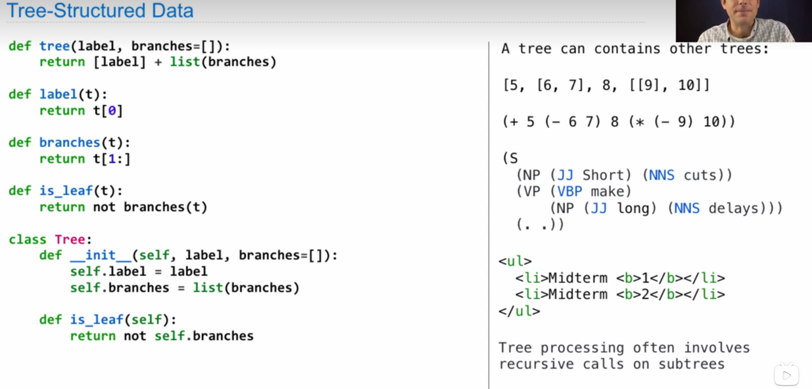
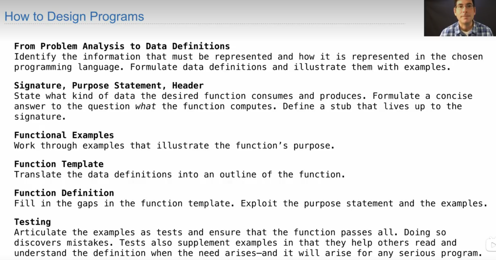

# THE LAST CLASS


the meaning of learning recursion
1. step 1 understand problem
2. think about ane example and study it for a while
3. a diagram is always helpful
4. may find the template not useful which is not a problem
5. when you find it's hard to track arg wht not define a high-order function
6. aggregate [b for b in a.branches]
7. label the var
8. class tree can stop easily
9. manually checking these problems needs to understand the interpretation
10. recursive can be accumulated through non-local statement n or return 
   
``` python
def big(t):
    def f(a, x):
        if a.label > x:
            return 1 + sum[f(b, a.label) for b in a.branches]
        else:
            return sum[f(b, x) for b in a.branches]
    return f(t, t.label - 1)  
```



``` python
def tree(t):
    """ just for demo
    >>> a = tree()
    xxxxx
    >>> b = tree()
    xxxxx
    """
    def xxx
```